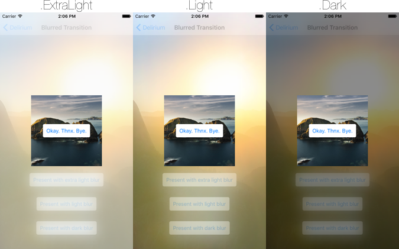
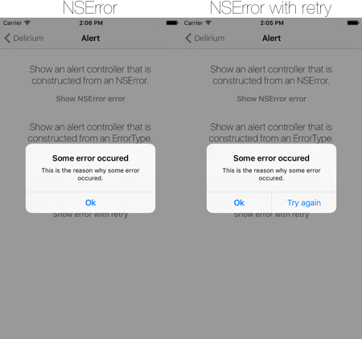
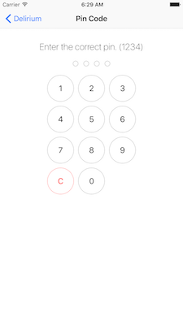

[](https://travis-ci.org/icapps/ios-delirium)
[](http://cocoapods.org/pods/Delirium)
[](http://cocoapods.org/pods/Delirium)
[](http://cocoapods.org/pods/Delirium)
[](https://swift.org)

> Delirium contains a set of UI components that can be reused during development.

## TOC

- [Installation](#installation)
- [Features](#features)
  - [Animations](#animations)
    - [Blurred Transition](#blurred-transition)
    - [Shake](#shake)
  - [Controllers](#controllers)
    - [Alert](#alert)
    - [Pin](#pin)
- [Bucket List](#bucket-list)
- [Author](#author)
- [License](#license)

## Installation

Delirium is available through [CocoaPods](http://cocoapods.org). To install it, simply add the following line to your `Podfile`:

```ruby
pod 'Delirium', '~> 0.4'
```

## Features

### Animations

#### Blurred Transition

Add some custom modal transitions to your application. Here is an example of what this transition looks like:



You can pass all the values of `UIBlurEffectStyle` to the `ActionTransitioningDelegate` class. And here is how you implement this transition.

```swift
let transitionDelegate = ActionTransitioningDelegate()

required init?(coder aDecoder: NSCoder) {
  super.init(coder: aDecoder)

  transitionDelegate.blurEffectStyle = .Light
  transitioningDelegate = transitionDelegate
  modalPresentationStyle = .Custom
}
```

_This transition will only work on iOS 9._

#### Shake

You can shake a UIView with this handy `shake` function.

```swift
let view: UIView = ...

// Shake the view with the default `duration` of 0.07 seconds and a `repeatCount` of 4.
view.shake()

// You can also pass a custom `duration` or `repeatCount` is wanted.
view.shake(repeatCount: 10, duration: 1.0)
```

## Controllers

### Alert

You can present an `NSError` from your `UIViewController` instance. This will present a `UIAlertController` with a title translated by the 'delirium.alert.button.ok' key. And with a description `localizedDescription` from `NSError`.

Here is an example of how it looks:



And here how to implement:

```swift
let error: NSError = ...
presentAlertController(withError: error)
```

When you want to present an 'ErrorType' than you'll have to conform to the `AlertError` protocol. This will make sure that the `ErrorType` has a title and a description to show in the alert.

```swift
struct SomeError: AlertError {
  var title: String { return "Some error occured" }
  var description: String { return "This is the reason why some error occured." }
}

let error: SomeError = ...
presentAlertController(withError: error)
```

All the `presentAlertController` function can have a `retry` closure. When implementing this closure you will get a 'Try again' button in the alert. When tapping this button the closure will be triggered.

```swift
let error: NSError = ...
presentAlertController(withError: error) {
  // Tapped retry.
}
```

### Pin

Present a pin view controller is really easy with _Delirium_.



```swift
let controller = pinViewController()
controller.delegate = self
navigationController?.pushViewController(controller, animated: true)
```

When you set the delegate to be the current controller. Than this controller needs to conform to `PinViewControllerDelegate`. Which means that the following method should be implemented.

```swift
func pinViewController(controller: PinViewController, didEnterPin pin: String) {
    // This method is called whenever your pin code is complete.
    // So when the `numberOfDigitis` matched the pin count.
}
```

You can pass a custom configuration to the `PinViewController`. Here are some of the options that can be configured:

```swift
let configuration = PinConfiguration()

// Define the number of digits you want to enter.
configuration.numberOfDigits = 4
// The title to be displayed in the navigation bar.
configuration.title = "Enter your pin"
// The color of the filled dot at the top of the pin view.
configuration.dotColor = UIColor(red:0.11, green:0.68, blue:0.93, alpha:1.00)
// The color of the stroked dot at the top of the pin view.
configuration.dotStrokeColor = UIColor(red:0.73, green:0.77, blue:0.81, alpha:1.00)
// The color of the stroked pin number button.
configuration.numberStrokeColor = UIColor(red:0.75, green:0.79, blue:0.83, alpha:1.00)
// The color of the highlighted background in the pin number button.
configuration.selectionBackgroundColor = UIColor(red:0.90, green:0.91, blue:0.93, alpha:1.00)
// The color of the background in the pin number button.
configuration.backgroundColor = UIColor.whiteColor()
// The color of the text in the pin number button.
configuration.numberTextColor = UIColor(red:0.01, green:0.13, blue:0.28, alpha:1.00)
```

You can set the configuration by passing the `configuration` instance to the `pinViewController()` method.

```swift
let configuration = PinConfiguration()
let controller = pinViewController(withConfiguration: configuration)
```

## Bucket List

Here is an overview what is on our todo list.

- [ ] Add `UIView` Wiggle.

## Author

Jelle Vandebeeck, jelle@fousa.be

## License

Delirium is available under the MIT license. See the LICENSE file for more info.
